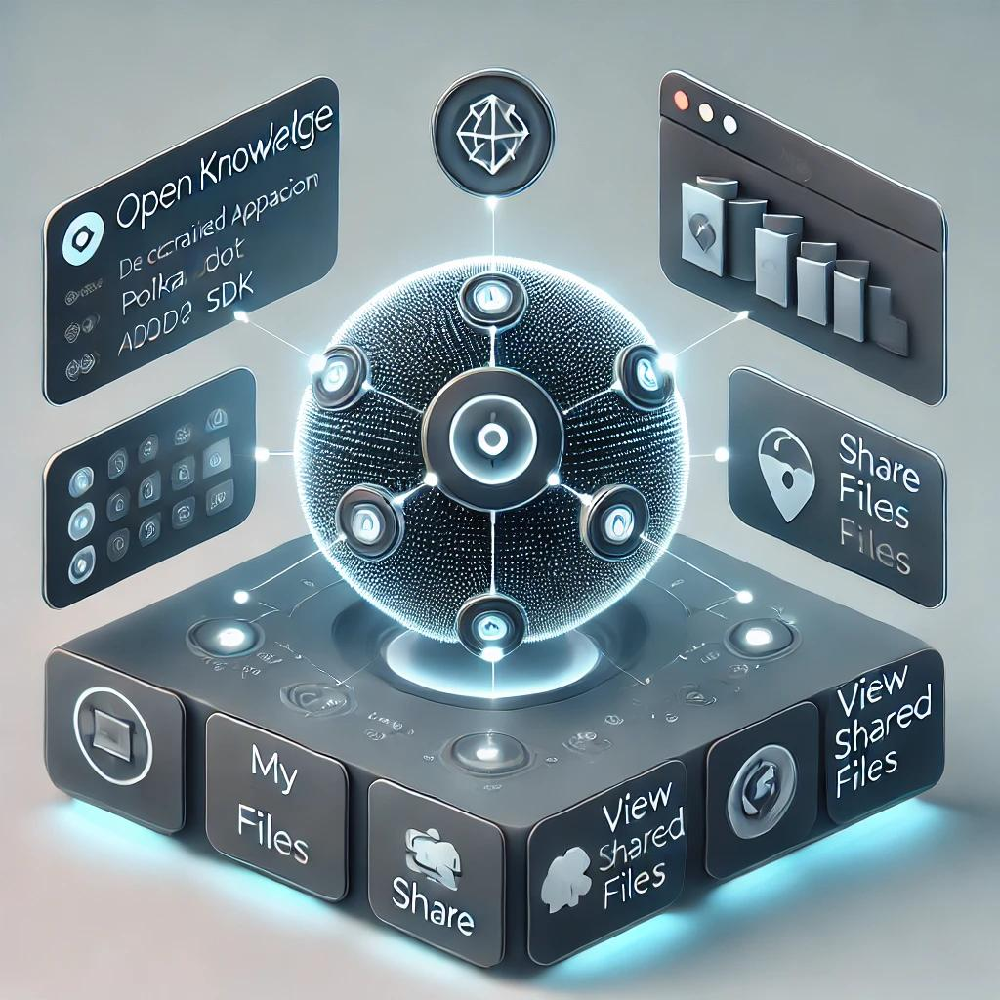

### Open Knowledge

- Developed with the Apillon SDK

* Key Features

1. Wallet Integration: Users can easily link their Polkadot wallets to the decentralized application (dApp), offering a secure and tailored experience.

2. File Upload and Organization: Once their wallet is connected, users can upload files of any type with ease. All uploaded files are organized in the "My Files" section, creating a centralized space for user content.

3. File Sharing: Users can share their uploaded files directly with other Polkadot wallet holders. The "Share" tab enables safe and seamless file sharing between users.

4. Access to Shared Files: The "View Shared Files" section allows users to quickly access all files shared with them by other users. This feature keeps shared content easily accessible and neatly arranged within the dApp.

