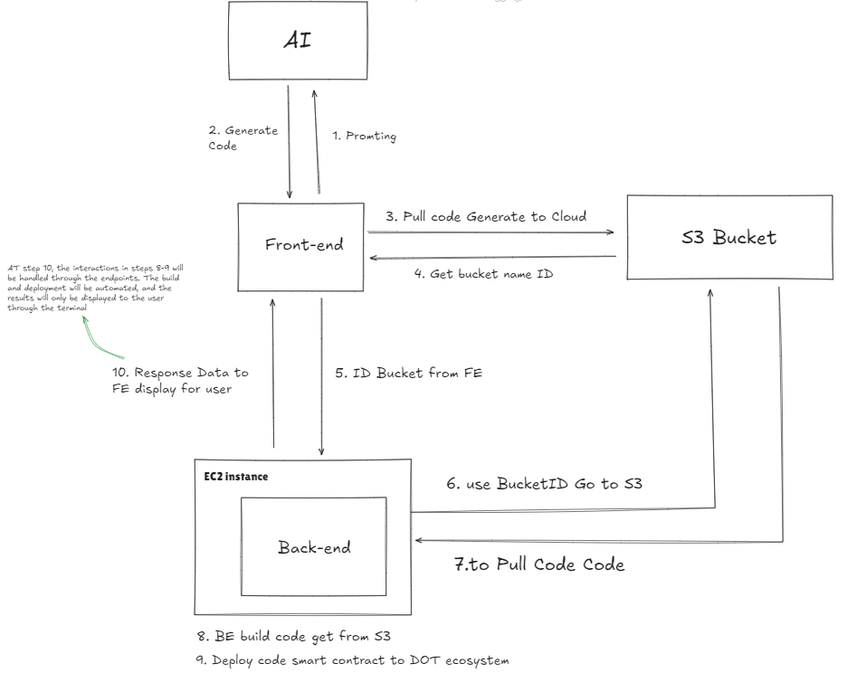

# Project Infomation

### Project Name: BubbleDOT
##### **Project Creation Date:** 9/2024

---

# **Project overall introduction**

BubbleDOT is an AI-powered coding assistant that can generate entire project folders; simplify the process of creating, testing, and deploying blockchain applications, leveraging AI to streamline every step from smart contract development to Polkadot deployment.

---

# **Planned Code Deliverables during the Hackathon**

### Frontend (Web3 Integration)
- Dashboard Page.
- Code Generation Page.     
  - Input fields for user requirements.
  - Options for generating boilerplate code (Rust, Polkadot).

### Backend (deploy)
- [x] [Download code from Cloud](https://github.com/PhucLam202/polkadot-hackathon-2024/blob/43-BubbleDOT/bangkok/43-BubbleDOT/src/BubbleDOT-BE/src/services/Download.Service.ts) (`downloadAllFilesFromBucket()`)
- [x] [Build data file](https://github.com/PhucLam202/polkadot-hackathon-2024/blob/43-BubbleDOT/bangkok/43-BubbleDOT/src/BubbleDOT-BE/src/services/build.Service.ts)(`buildProject()`) 
- [ ] [Deploy smart contract](https://github.com/PhucLam202/polkadot-hackathon-2024/blob/43-BubbleDOT/bangkok/43-BubbleDOT/src/BubbleDOT-BE/src/services/deployDD.Service.ts)(`deployContract()`) 
- [x] [Get data deploy](https://github.com/PhucLam202/polkadot-hackathon-2024/blob/43-BubbleDOT/bangkok/43-BubbleDOT/src/BubbleDOT-BE/src/services/getBuildDataFile.Service.ts)(`getFileContent()`)
- [x] [Publish data to Phala network](https://github.com/PhucLam202/Polkadot-Hackathon2024/blob/main/BubbleDOT-BE/src/configs/publish.ts)
      - Video Deploy Interact Phala: [youtube](https://youtu.be/7a5TuQ3yXY8) 
- [x] [Chat AI](https://github.com/PhucLam202/Polkadot-Hackathon2024/blob/main/BubbleDOT-BE/src/controllers/chatAI.controller.ts)(`openAIEndpoint()`)
- [x] [Chat AI Service](https://github.com/PhucLam202/Polkadot-Hackathon2024/blob/main/BubbleDOT-BE/src/services/chatAI.Service.ts)(`chatAI.Service()`)

### AI 
- Code Snippet Generation
  - On-the-fly code generation for specific tasks.
- Folder Structure Generation
  - Auto generate projects with preconfigured tools (Polkadot, Rust).
---
### **Project Logo**

## **Project Background**

Our project has not received any financial support from other hackathons, application for Web3 Foundation Grant and other fundings.

The rise of decentralized technologies has paved the way for new and innovative applications that challenge traditional systems. As Web3 continues to evolve, one critical aspect is the need for efficient, secure, and privacy-centric communication tools for developers working within the blockchain ecosystem, particularly those focused on Polkadot and Rust.

## **Problem to be Solved**

Currently, developers face several problems:

1. **Time-consuming project setup:** Manually setting up project structures and writing boilerplate code can be tedious and time-consuming. 
2. **Complexity of building applications:** Creating intricate features and integrations can be challenging, especially for developers with limited experience. 
3. **Difficult to understand and adjust:** Many AI-assistant tools only provide individual code snippets, not a complete, executable project. Code visualization is also limited, making it difficult to understand how different parts of the code interact with each other.

---

## **Project Overview**

BubbleDOT can generate entire project folders; simplify the process of creating, testing, and deploying blockchain applications, leveraging AI to streamline every step from smart contract development to Polkadot deployment.

Features:

- **Comprehensive Project Generation:** Unlike other AI coding tools that focus on generating individual code snippets, BubbleDOT creates entire project structures, saving developers significant time and effort.
- **Better visualization and Understanding:** Provides a visual representation of generated code for better understanding.

---

## **Technical Architecture**

---

### How Bubble DOT work? 

- ***User Input:*** The user provides a text prompt or description of the desired project.
- ***AI Processing & Code Generation:*** BubbleDOT's AI models analyze the prompt to understand the project's requirements. Then it will generates a comprehensive project folder containing all the necessary files and code. The generated code is structured, well-formatted, and adheres to best practices
- ***Run & Test:*** Users can further adjust the prompt or clarify their wants and examine the generated code to fit their specific needs.

---

## **Project Completed During the Hackathon**

We are developing a web-based application that integrates AI to generate code files, which can be executed directly within the browser environment.

---

## **Team Information**

- Cao Đặng Tình  
  **Role**: Web Developer  
  **Github**: https://github.com/DangTinh422003  
  **Email**: caodangtinh04022003@gmail.com  

- Lâm Thanh Phúc  
  **Role**: Back-end Developer
  
  **Github**: [PhucLam202](https://github.com/PhucLam202)  
  **Email**: lamthanhphucit@gmail.com  

- Nguyễn Dư Thành Long  
  **Role**: UI Designer  
  **Github**: nglongng  
  **Email**: ngdtlong@gmail.com  

- Nguyễn Hải Hoài Trinh  
  **Role**: Marketing/Business Planner   
  **Github**: https://github.com/Htrinhngg  
  **Email**: trinhnguyen.23122005@gmail.com  
---
# **Material for Demo**
**Details**

- Demo video: https://www.youtube.com/watch?v=MCIxH1anTgY
- Pitch deck: https://drive.google.com/file/d/1XqAPTgpTQYNuv0-3i4lrZFRVCgXRSDG-/view?usp=sharing

---

    
